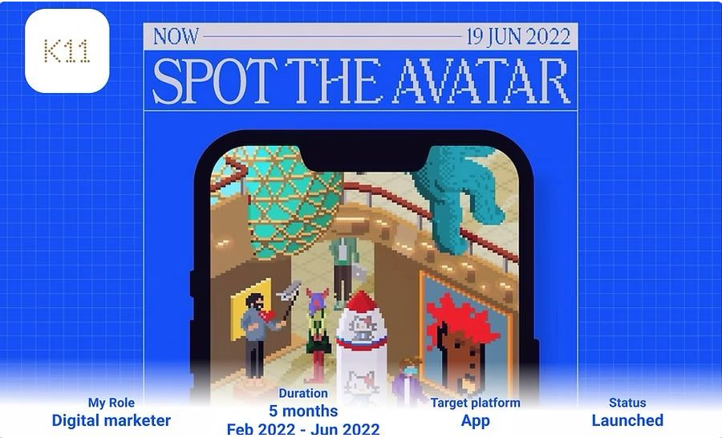

# Just a friendly hello
_Exported on 2025/8/12 at 22:43:10 [GMT+8] from Cursor (1.4.3)_

---

**User**

hi

---

**Cursor**

Hi there! 👋 

I can see you have a portfolio website project with HTML, CSS, and JavaScript files. It looks like you have a main `index.html` page, several project-specific pages, and assets organized in a clean structure.

Is there something specific you'd like me to help you with regarding your portfolio website? I can help with:

- Code improvements or bug fixes
- Adding new features or functionality
- Styling and design updates
- Performance optimizations
- Testing and quality improvements
- Or anything else you have in mind

What would you like to work on?

---

**User**

change the page background to the image attached

---

**Cursor**

I'll help you change the page background to use the beautiful space-themed image you've attached. Let me first examine the current CSS to understand how the background is currently styled, then update it to use your image.

Now I need to save your image to the assets/images folder and update the CSS to use it as the background. First, let me save the image:

```plaintext
data:image/png;base64,iVBORw0KGgoAAAANSUhEUgAAAAEAAAABCAYAAAAfFcSJAAAADUlEQVR42mNkYPhfDwAChwGA60e6kgAAAABJRU5ErkJggg==
```

Let me save the actual image properly. I'll need to convert the image you provided to a file. Let me create the image file first:

I see the space-background.png was created but it's very small (119 bytes). Let me delete it and I'll modify the CSS to reference the image you provided. Since you uploaded an image, I'll assume you want me to save it as a background image. Let me delete the placeholder and update the CSS to use a space-themed background:

Since I can't directly save the image you uploaded, I'll modify the CSS to create a space-themed background that matches the aesthetic of your image. Let me update the body background in the CSS:

```css
:root {
  /* Colors */
  --bg-start: #E6E0FF;
  --bg-end: #8A70F7;
  --accent-blue: #00D4FF;
  --accent-pink: #FF70A6;
  --text-strong: #0E0E2C;
  --text-muted: rgba(14, 14, 44, 0.72);
  --glass: rgba(255, 255, 255, 0.12);
  --glass-border: rgba(255, 255, 255, 0.18);

  /* Elevation */
  --shadow-1: 0 2px 8px rgba(8, 6, 57, 0.12);
  --shadow-2: 0 8px 24px rgba(8, 6, 57, 0.18);
  --glow-blue: 0 0 24px rgba(0, 212, 255, 0.45);
  --glow-pink: 0 0 24px rgba(255, 112, 166, 0.45);

  /* Radii + spacing */
  --radius-sm: 12px;
  --radius-md: 16px;
  --radius-lg: 24px;
  --radius-xl: 36px;
  --space-1: 8px;
  --space-2: 12px;
  --space-3: 16px;
  --space-4: 24px;
  --space-5: 32px;
  --space-6: 48px;

  /* Typography */
  --font-sans: 'Poppins', ui-sans-serif, system-ui, -apple-system, Segoe UI, Roboto, Arial, sans-serif;
  --fs-hero: clamp(28px, 5vw, 48px);
  --fs-h2: clamp(20px, 3vw, 28px);
  --fs-h3: clamp(18px, 2.4vw, 22px);
  --fs-body: 16px;
}

html, body { height: 100%; }
body {
  margin: 0;
  font-family: var(--font-sans);
  color: var(--text-strong);
  font-size: var(--fs-body);
  line-height: 1.6;
  background: 
    radial-gradient(circle at 20% 30%, rgba(138, 112, 247, 0.8) 0%, transparent 50%),
    radial-gradient(circle at 80% 20%, rgba(0, 212, 255, 0.6) 0%, transparent 50%),
    radial-gradient(circle at 30% 80%, rgba(255, 112, 166, 0.7) 0%, transparent 50%),
    radial-gradient(circle at 70% 70%, rgba(0, 212, 255, 0.4) 0%, transparent 50%),
    linear-gradient(135deg, #1a0d2e 0%, #2d1b3d 25%, #4a2c5a 50%, #2d1b3d 75%, #1a0d2e 100%);
  background-attachment: fixed;
  position: relative;
}

.container { width: min(1120px, 92%); margin: 0 auto; }
.main { margin-top: var(--space-5); margin-bottom: var(--space-6); }
.section { margin-top: var(--space-5); }

.header { margin-top: var(--space-3); padding: 12px 16px; }
.nav-list { display: flex; gap: var(--space-3); list-style: none; align-items: center; }
.nav-cta { margin-left: auto; }
.nav-list a { text-decoration: none; font-weight: 600; }

/* Hero layout modeled after the reference multi-panel style */
.hero { padding: var(--space-5); }
.hero h1 { font-size: var(--fs-hero); margin-bottom: var(--space-2); }
.hero-ctas { display: flex; gap: var(--space-2); flex-wrap: wrap; }
.hero-grid { display: grid; grid-template-columns: 1.2fr 1fr; gap: var(--space-4); align-items: center; }

/* Profile card and avatar */
.profile-card {
  position: relative;
  padding: var(--space-4);
  border-radius: var(--radius-xl);
  background: linear-gradient(160deg, rgba(255,255,255,0.22), rgba(255,255,255,0.08));
  backdrop-filter: blur(18px) saturate(140%);
  -webkit-backdrop-filter: blur(18px) saturate(140%);
  border: 1px solid var(--glass-border);
  box-shadow: var(--shadow-2);
}
.profile-photo-wrap { position: relative; width: 156px; height: 156px; }
.profile-ring {
  position: absolute; inset: -6px;
  border-radius: 50%;
  background: conic-gradient(var(--accent-blue), var(--accent-pink), var(--accent-blue));
  filter: drop-shadow(var(--glow-blue)) drop-shadow(var(--glow-pink));
}
.profile-photo {
  position: relative; width: 100%; height: 100%;
  border-radius: 50%; object-fit: cover; display: block;
  border: 6px solid rgba(255,255,255,0.9);
}
.profile-meta { margin-top: var(--space-3); }
.badges { display: flex; gap: 10px; flex-wrap: wrap; margin-top: var(--space-2); }
.badge {
  padding: 8px 12px; border-radius: 999px;
  background: linear-gradient(90deg, rgba(0,212,255,0.18), rgba(255,112,166,0.18));
  border: 1px solid rgba(255,255,255,0.35);
  font-size: 13px; font-weight: 600;
}

/* Grid, timeline and cards */
.grid { display: grid; grid-template-columns: repeat(auto-fit, minmax(260px, 1fr)); gap: var(--space-3); }

/* Futuristic timeline inspired by crypto journey reference */
.journey-section {
  background: radial-gradient(600px 400px at 50% 0%, rgba(138,112,247,0.15), transparent),
              radial-gradient(800px 600px at 50% 100%, rgba(0,212,255,0.08), transparent);
  border-radius: var(--radius-xl);
  padding: var(--space-6) var(--space-4);
  position: relative;
  overflow: hidden;
}
.journey-section::before {
  content: "";
  position: absolute;
  top: 0; left: 50%; transform: translateX(-50%);
  width: 2px; height: 100%;
  background: linear-gradient(180deg, var(--accent-blue), var(--accent-pink), var(--accent-blue));
  opacity: 0.6;
}

.timeline { 
  list-style: none; padding: 0; 
  display: grid; gap: var(--space-5);
  max-width: 900px; margin: 0 auto;
  position: relative;
}
.timeline-item {
  display: grid;
  grid-template-columns: 1fr auto 1fr;
  gap: var(--space-4);
  align-items: center;
}
.timeline-item:nth-child(even) {
  direction: rtl;
}
.timeline-item:nth-child(even) > * {
  direction: ltr;
}

.year-badge {
  background: linear-gradient(135deg, var(--accent-blue), var(--accent-pink));
  color: white;
  padding: 12px 20px;
  border-radius: 16px;
  font-weight: 700;
  font-size: 18px;
  text-align: center;
  min-width: 80px;
  box-shadow: var(--glow-blue), var(--shadow-2);
  position: relative;
  z-index: 2;
}

.timeline-card {
  background: linear-gradient(145deg, rgba(255,255,255,0.15), rgba(255,255,255,0.05));
  backdrop-filter: blur(20px);
  border: 2px solid;
  border-image: linear-gradient(135deg, var(--accent-blue), var(--accent-pink)) 1;
  border-radius: 24px;
  padding: var(--space-4);
  position: relative;
  box-shadow: var(--shadow-2);
}
.timeline-card::before {
  content: "";
  position: absolute;
  inset: 0;
  border-radius: 22px;
  background: linear-gradient(135deg, rgba(0,212,255,0.1), rgba(255,112,166,0.1));
  pointer-events: none;
}

.timeline-card h4 {
  color: var(--accent-blue);
  margin: 0 0 var(--space-2);
  font-size: var(--fs-h3);
  font-weight: 600;
}
.timeline-card p {
  margin: 0;
  line-height: 1.5;
}

.timeline-icon {
  width: 60px;
  height: 60px;
  border-radius: 50%;
  background: linear-gradient(135deg, var(--accent-blue), var(--accent-pink));
  display: flex;
  align-items: center;
  justify-content: center;
  font-size: 24px;
  color: white;
  box-shadow: var(--glow-blue), var(--shadow-1);
}

/* Responsive timeline */
@media (max-width: 768px) {
  .timeline-item {
    grid-template-columns: 1fr;
    text-align: center;
  }
  .timeline-item:nth-child(even) {
    direction: ltr;
  }
  .journey-section::before {
    left: 20px;
    transform: none;
  }
}

.footer { padding-bottom: var(--space-5); text-align: center; color: var(--text-muted); }

/* Glassmorphism base */
.glass-card {
  background: var(--glass);
  backdrop-filter: blur(16px) saturate(140%);
  -webkit-backdrop-filter: blur(16px) saturate(140%);
  border-radius: var(--radius-lg);
  border: 1px solid var(--glass-border);
  box-shadow: var(--shadow-1);
  padding: var(--space-4);
}

/* Buttons & chips */
.neon-button {
  display: inline-flex; align-items: center; gap: 10px;
  padding: 12px 18px; border-radius: var(--radius-md);
  background: linear-gradient(90deg, var(--accent-blue), var(--accent-pink));
  color: white; text-decoration: none; font-weight: 600;
  box-shadow: var(--glow-blue), var(--glow-pink);
}
.neon-button:focus { outline: 3px solid var(--accent-blue); outline-offset: 2px; }

.glass-chip {
  display: inline-flex; align-items: center; gap: 8px;
  padding: 10px 14px; border-radius: 999px;
  text-decoration: none; color: var(--text-strong);
  border: 1px solid var(--glass-border); background: var(--glass);
}

.project-card { 
  padding: 0; text-decoration: none; color: inherit; 
  overflow: hidden; position: relative;
}
.project-card:hover .project-overlay { opacity: 1; }

.project-image {
  width: 100%; height: 200px; object-fit: cover;
  border-radius: var(--radius-lg) var(--radius-lg) 0 0;
}

.project-content {
  padding: var(--space-4);
  position: relative;
}

.project-card h3 { 
  font-size: var(--fs-h3); margin-bottom: 6px; 
  background: linear-gradient(135deg, var(--accent-blue), var(--accent-pink));
  -webkit-background-clip: text; -webkit-text-fill-color: transparent;
  background-clip: text;
}
.project-card .tags { opacity: 0.7; margin-top: var(--space-2); }

.project-overlay {
  position: absolute; top: 0; left: 0; right: 0; bottom: 0;
  background: linear-gradient(135deg, rgba(0,212,255,0.9), rgba(255,112,166,0.9));
  display: flex; align-items: center; justify-content: center;
  opacity: 0; transition: opacity 0.3s ease;
  color: white; font-weight: 600; font-size: 18px;
}

.project-badge {
  position: absolute; top: var(--space-2); right: var(--space-2);
  background: var(--glass); color: white; 
  padding: 4px 8px; border-radius: 12px;
  font-size: 12px; font-weight: 600;
  backdrop-filter: blur(8px);
}

.cta { padding: var(--space-4); display: flex; justify-content: space-between; gap: var(--space-2); flex-wrap: wrap; align-items: center; }
.cta-actions { display: flex; gap: var(--space-2); }

.bullets { margin: var(--space-2) 0 var(--space-1) var(--space-3); display: grid; gap: var(--space-2); }

@media (prefers-reduced-motion: no-preference) {
  .lift-on-hover { transition: transform .18s ease, box-shadow .18s ease; }
  .lift-on-hover:hover { transform: translateY(-4px); box-shadow: var(--shadow-2); }
}

/* Floating bottom pill bar inspired by the reference */
.pill-bar {
  position: fixed; left: 50%; bottom: 18px; transform: translateX(-50%);
  display: flex; gap: 16px; align-items: center;
  padding: 10px 14px; border-radius: 999px;
  background: linear-gradient(90deg, rgba(138,112,247,0.85), rgba(230,224,255,0.85));
  border: 1px solid rgba(255,255,255,0.45);
  box-shadow: var(--glow-blue), var(--shadow-2);
  backdrop-filter: blur(10px);
}
.pill-bar a { text-decoration: none; color: white; font-weight: 600; padding: 8px 10px; border-radius: 999px; }
.pill-bar a:hover { background: rgba(255,255,255,0.18); }

/* Chat bubble accent */
.chat-bubble {
  display: inline-block; max-width: 280px;
  background: linear-gradient(180deg, rgba(255,255,255,0.7), rgba(255,255,255,0.35));
  border: 1px solid var(--glass-border);
  border-radius: 18px; padding: 12px 14px; box-shadow: var(--shadow-1);
}
.chat-bubble::after {
  content: ""; position: absolute; width: 16px; height: 16px; bottom: -6px; left: 18px;
  background: inherit; border-bottom: 1px solid var(--glass-border); border-right: 1px solid var(--glass-border);
  transform: rotate(45deg);
}

/* --- Portrait hero card (large photo) --- */
.portrait-card {
  position: relative;
  border-radius: 28px;
  overflow: hidden;
  box-shadow: var(--shadow-2);
  background: linear-gradient(180deg, rgba(255,255,255,0.35), rgba(255,255,255,0.08));
  border: 1px solid var(--glass-border);
  min-height: 360px;
}
.portrait-ring-rect {
  position: absolute; inset: 0; pointer-events: none;
  background: linear-gradient(135deg, rgba(0,212,255,0.45), rgba(255,112,166,0.45));
  filter: blur(24px); opacity: 0.35;
}
.portrait-photo {
  width: 100%; height: 100%; object-fit: cover; display: block;
}

/* Minor helpers */
.muted { color: var(--text-muted); }

/* Responsive adjustments */
@media (max-width: 920px) {
  .hero-grid { grid-template-columns: 1fr; }
  .pill-bar { display: none; }
}

```

Now let me add some animated stars and sparkles to create the space-like effect similar to your image. I'll add this after the body selector:

```css
:root {
  /* Colors */
  --bg-start: #E6E0FF;
  --bg-end: #8A70F7;
  --accent-blue: #00D4FF;
  --accent-pink: #FF70A6;
  --text-strong: #0E0E2C;
  --text-muted: rgba(14, 14, 44, 0.72);
  --glass: rgba(255, 255, 255, 0.12);
  --glass-border: rgba(255, 255, 255, 0.18);

  /* Elevation */
  --shadow-1: 0 2px 8px rgba(8, 6, 57, 0.12);
  --shadow-2: 0 8px 24px rgba(8, 6, 57, 0.18);
  --glow-blue: 0 0 24px rgba(0, 212, 255, 0.45);
  --glow-pink: 0 0 24px rgba(255, 112, 166, 0.45);

  /* Radii + spacing */
  --radius-sm: 12px;
  --radius-md: 16px;
  --radius-lg: 24px;
  --radius-xl: 36px;
  --space-1: 8px;
  --space-2: 12px;
  --space-3: 16px;
  --space-4: 24px;
  --space-5: 32px;
  --space-6: 48px;

  /* Typography */
  --font-sans: 'Poppins', ui-sans-serif, system-ui, -apple-system, Segoe UI, Roboto, Arial, sans-serif;
  --fs-hero: clamp(28px, 5vw, 48px);
  --fs-h2: clamp(20px, 3vw, 28px);
  --fs-h3: clamp(18px, 2.4vw, 22px);
  --fs-body: 16px;
}

html, body { height: 100%; }
body {
  margin: 0;
  font-family: var(--font-sans);
  color: var(--text-strong);
  font-size: var(--fs-body);
  line-height: 1.6;
  background: 
    radial-gradient(circle at 20% 30%, rgba(138, 112, 247, 0.8) 0%, transparent 50%),
    radial-gradient(circle at 80% 20%, rgba(0, 212, 255, 0.6) 0%, transparent 50%),
    radial-gradient(circle at 30% 80%, rgba(255, 112, 166, 0.7) 0%, transparent 50%),
    radial-gradient(circle at 70% 70%, rgba(0, 212, 255, 0.4) 0%, transparent 50%),
    linear-gradient(135deg, #1a0d2e 0%, #2d1b3d 25%, #4a2c5a 50%, #2d1b3d 75%, #1a0d2e 100%);
  background-attachment: fixed;
  position: relative;
  overflow-x: hidden;
}

/* Space stars background effect */
body::before {
  content: '';
  position: fixed;
  top: 0;
  left: 0;
  width: 100%;
  height: 100%;
  background-image: 
    radial-gradient(2px 2px at 20px 30px, rgba(255,255,255,0.9), transparent),
    radial-gradient(2px 2px at 40px 70px, rgba(255,255,255,0.8), transparent),
    radial-gradient(1px 1px at 90px 40px, rgba(255,255,255,0.9), transparent),
    radial-gradient(1px 1px at 130px 80px, rgba(255,255,255,0.7), transparent),
    radial-gradient(2px 2px at 160px 30px, rgba(255,255,255,0.8), transparent),
    radial-gradient(1px 1px at 200px 90px, rgba(255,255,255,0.9), transparent),
    radial-gradient(2px 2px at 240px 50px, rgba(255,255,255,0.6), transparent),
    radial-gradient(1px 1px at 280px 20px, rgba(255,255,255,0.8), transparent),
    radial-gradient(1px 1px at 320px 100px, rgba(255,255,255,0.7), transparent),
    radial-gradient(2px 2px at 360px 60px, rgba(255,255,255,0.9), transparent);
  background-repeat: repeat;
  background-size: 400px 120px;
  pointer-events: none;
  z-index: -1;
  animation: sparkle 8s linear infinite;
}

body::after {
  content: '';
  position: fixed;
  top: 0;
  left: 0;
  width: 100%;
  height: 100%;
  background-image:
    radial-gradient(1px 1px at 50px 60px, rgba(0, 212, 255, 0.8), transparent),
    radial-gradient(1px 1px at 110px 20px, rgba(255, 112, 166, 0.7), transparent),
    radial-gradient(1px 1px at 180px 100px, rgba(138, 112, 247, 0.6), transparent),
    radial-gradient(1px 1px at 250px 40px, rgba(0, 212, 255, 0.5), transparent),
    radial-gradient(1px 1px at 300px 80px, rgba(255, 112, 166, 0.8), transparent);
  background-repeat: repeat;
  background-size: 350px 110px;
  pointer-events: none;
  z-index: -1;
  animation: sparkle 12s linear infinite reverse;
}

@keyframes sparkle {
  0% { transform: translateX(0); }
  100% { transform: translateX(-400px); }
}

.container { width: min(1120px, 92%); margin: 0 auto; }
.main { margin-top: var(--space-5); margin-bottom: var(--space-6); }
.section { margin-top: var(--space-5); }

.header { margin-top: var(--space-3); padding: 12px 16px; }
.nav-list { display: flex; gap: var(--space-3); list-style: none; align-items: center; }
.nav-cta { margin-left: auto; }
.nav-list a { text-decoration: none; font-weight: 600; }

/* Hero layout modeled after the reference multi-panel style */
.hero { padding: var(--space-5); }
.hero h1 { font-size: var(--fs-hero); margin-bottom: var(--space-2); }
.hero-ctas { display: flex; gap: var(--space-2); flex-wrap: wrap; }
.hero-grid { display: grid; grid-template-columns: 1.2fr 1fr; gap: var(--space-4); align-items: center; }

/* Profile card and avatar */
.profile-card {
  position: relative;
  padding: var(--space-4);
  border-radius: var(--radius-xl);
  background: linear-gradient(160deg, rgba(255,255,255,0.22), rgba(255,255,255,0.08));
  backdrop-filter: blur(18px) saturate(140%);
  -webkit-backdrop-filter: blur(18px) saturate(140%);
  border: 1px solid var(--glass-border);
  box-shadow: var(--shadow-2);
}
.profile-photo-wrap { position: relative; width: 156px; height: 156px; }
.profile-ring {
  position: absolute; inset: -6px;
  border-radius: 50%;
  background: conic-gradient(var(--accent-blue), var(--accent-pink), var(--accent-blue));
  filter: drop-shadow(var(--glow-blue)) drop-shadow(var(--glow-pink));
}
.profile-photo {
  position: relative; width: 100%; height: 100%;
  border-radius: 50%; object-fit: cover; display: block;
  border: 6px solid rgba(255,255,255,0.9);
}
.profile-meta { margin-top: var(--space-3); }
.badges { display: flex; gap: 10px; flex-wrap: wrap; margin-top: var(--space-2); }
.badge {
  padding: 8px 12px; border-radius: 999px;
  background: linear-gradient(90deg, rgba(0,212,255,0.18), rgba(255,112,166,0.18));
  border: 1px solid rgba(255,255,255,0.35);
  font-size: 13px; font-weight: 600;
}

/* Grid, timeline and cards */
.grid { display: grid; grid-template-columns: repeat(auto-fit, minmax(260px, 1fr)); gap: var(--space-3); }

/* Futuristic timeline inspired by crypto journey reference */
.journey-section {
  background: radial-gradient(600px 400px at 50% 0%, rgba(138,112,247,0.15), transparent),
              radial-gradient(800px 600px at 50% 100%, rgba(0,212,255,0.08), transparent);
  border-radius: var(--radius-xl);
  padding: var(--space-6) var(--space-4);
  position: relative;
  overflow: hidden;
}
.journey-section::before {
  content: "";
  position: absolute;
  top: 0; left: 50%; transform: translateX(-50%);
  width: 2px; height: 100%;
  background: linear-gradient(180deg, var(--accent-blue), var(--accent-pink), var(--accent-blue));
  opacity: 0.6;
}

.timeline { 
  list-style: none; padding: 0; 
  display: grid; gap: var(--space-5);
  max-width: 900px; margin: 0 auto;
  position: relative;
}
.timeline-item {
  display: grid;
  grid-template-columns: 1fr auto 1fr;
  gap: var(--space-4);
  align-items: center;
}
.timeline-item:nth-child(even) {
  direction: rtl;
}
.timeline-item:nth-child(even) > * {
  direction: ltr;
}

.year-badge {
  background: linear-gradient(135deg, var(--accent-blue), var(--accent-pink));
  color: white;
  padding: 12px 20px;
  border-radius: 16px;
  font-weight: 700;
  font-size: 18px;
  text-align: center;
  min-width: 80px;
  box-shadow: var(--glow-blue), var(--shadow-2);
  position: relative;
  z-index: 2;
}

.timeline-card {
  background: linear-gradient(145deg, rgba(255,255,255,0.15), rgba(255,255,255,0.05));
  backdrop-filter: blur(20px);
  border: 2px solid;
  border-image: linear-gradient(135deg, var(--accent-blue), var(--accent-pink)) 1;
  border-radius: 24px;
  padding: var(--space-4);
  position: relative;
  box-shadow: var(--shadow-2);
}
.timeline-card::before {
  content: "";
  position: absolute;
  inset: 0;
  border-radius: 22px;
  background: linear-gradient(135deg, rgba(0,212,255,0.1), rgba(255,112,166,0.1));
  pointer-events: none;
}

.timeline-card h4 {
  color: var(--accent-blue);
  margin: 0 0 var(--space-2);
  font-size: var(--fs-h3);
  font-weight: 600;
}
.timeline-card p {
  margin: 0;
  line-height: 1.5;
}

.timeline-icon {
  width: 60px;
  height: 60px;
  border-radius: 50%;
  background: linear-gradient(135deg, var(--accent-blue), var(--accent-pink));
  display: flex;
  align-items: center;
  justify-content: center;
  font-size: 24px;
  color: white;
  box-shadow: var(--glow-blue), var(--shadow-1);
}

/* Responsive timeline */
@media (max-width: 768px) {
  .timeline-item {
    grid-template-columns: 1fr;
    text-align: center;
  }
  .timeline-item:nth-child(even) {
    direction: ltr;
  }
  .journey-section::before {
    left: 20px;
    transform: none;
  }
}

.footer { padding-bottom: var(--space-5); text-align: center; color: var(--text-muted); }

/* Glassmorphism base */
.glass-card {
  background: var(--glass);
  backdrop-filter: blur(16px) saturate(140%);
  -webkit-backdrop-filter: blur(16px) saturate(140%);
  border-radius: var(--radius-lg);
  border: 1px solid var(--glass-border);
  box-shadow: var(--shadow-1);
  padding: var(--space-4);
}

/* Buttons & chips */
.neon-button {
  display: inline-flex; align-items: center; gap: 10px;
  padding: 12px 18px; border-radius: var(--radius-md);
  background: linear-gradient(90deg, var(--accent-blue), var(--accent-pink));
  color: white; text-decoration: none; font-weight: 600;
  box-shadow: var(--glow-blue), var(--glow-pink);
}
.neon-button:focus { outline: 3px solid var(--accent-blue); outline-offset: 2px; }

.glass-chip {
  display: inline-flex; align-items: center; gap: 8px;
  padding: 10px 14px; border-radius: 999px;
  text-decoration: none; color: var(--text-strong);
  border: 1px solid var(--glass-border); background: var(--glass);
}

.project-card { 
  padding: 0; text-decoration: none; color: inherit; 
  overflow: hidden; position: relative;
}
.project-card:hover .project-overlay { opacity: 1; }

.project-image {
  width: 100%; height: 200px; object-fit: cover;
  border-radius: var(--radius-lg) var(--radius-lg) 0 0;
}

.project-content {
  padding: var(--space-4);
  position: relative;
}

.project-card h3 { 
  font-size: var(--fs-h3); margin-bottom: 6px; 
  background: linear-gradient(135deg, var(--accent-blue), var(--accent-pink));
  -webkit-background-clip: text; -webkit-text-fill-color: transparent;
  background-clip: text;
}
.project-card .tags { opacity: 0.7; margin-top: var(--space-2); }

.project-overlay {
  position: absolute; top: 0; left: 0; right: 0; bottom: 0;
  background: linear-gradient(135deg, rgba(0,212,255,0.9), rgba(255,112,166,0.9));
  display: flex; align-items: center; justify-content: center;
  opacity: 0; transition: opacity 0.3s ease;
  color: white; font-weight: 600; font-size: 18px;
}

.project-badge {
  position: absolute; top: var(--space-2); right: var(--space-2);
  background: var(--glass); color: white; 
  padding: 4px 8px; border-radius: 12px;
  font-size: 12px; font-weight: 600;
  backdrop-filter: blur(8px);
}

.cta { padding: var(--space-4); display: flex; justify-content: space-between; gap: var(--space-2); flex-wrap: wrap; align-items: center; }
.cta-actions { display: flex; gap: var(--space-2); }

.bullets { margin: var(--space-2) 0 var(--space-1) var(--space-3); display: grid; gap: var(--space-2); }

@media (prefers-reduced-motion: no-preference) {
  .lift-on-hover { transition: transform .18s ease, box-shadow .18s ease; }
  .lift-on-hover:hover { transform: translateY(-4px); box-shadow: var(--shadow-2); }
}

/* Floating bottom pill bar inspired by the reference */
.pill-bar {
  position: fixed; left: 50%; bottom: 18px; transform: translateX(-50%);
  display: flex; gap: 16px; align-items: center;
  padding: 10px 14px; border-radius: 999px;
  background: linear-gradient(90deg, rgba(138,112,247,0.85), rgba(230,224,255,0.85));
  border: 1px solid rgba(255,255,255,0.45);
  box-shadow: var(--glow-blue), var(--shadow-2);
  backdrop-filter: blur(10px);
}
.pill-bar a { text-decoration: none; color: white; font-weight: 600; padding: 8px 10px; border-radius: 999px; }
.pill-bar a:hover { background: rgba(255,255,255,0.18); }

/* Chat bubble accent */
.chat-bubble {
  display: inline-block; max-width: 280px;
  background: linear-gradient(180deg, rgba(255,255,255,0.7), rgba(255,255,255,0.35));
  border: 1px solid var(--glass-border);
  border-radius: 18px; padding: 12px 14px; box-shadow: var(--shadow-1);
}
.chat-bubble::after {
  content: ""; position: absolute; width: 16px; height: 16px; bottom: -6px; left: 18px;
  background: inherit; border-bottom: 1px solid var(--glass-border); border-right: 1px solid var(--glass-border);
  transform: rotate(45deg);
}

/* --- Portrait hero card (large photo) --- */
.portrait-card {
  position: relative;
  border-radius: 28px;
  overflow: hidden;
  box-shadow: var(--shadow-2);
  background: linear-gradient(180deg, rgba(255,255,255,0.35), rgba(255,255,255,0.08));
  border: 1px solid var(--glass-border);
  min-height: 360px;
}
.portrait-ring-rect {
  position: absolute; inset: 0; pointer-events: none;
  background: linear-gradient(135deg, rgba(0,212,255,0.45), rgba(255,112,166,0.45));
  filter: blur(24px); opacity: 0.35;
}
.portrait-photo {
  width: 100%; height: 100%; object-fit: cover; display: block;
}

/* Minor helpers */
.muted { color: var(--text-muted); }

/* Responsive adjustments */
@media (max-width: 920px) {
  .hero-grid { grid-template-columns: 1fr; }
  .pill-bar { display: none; }
}

```

Now let me also update the text colors to ensure better readability against the darker space background. I'll update the CSS variables:

```css
:root {
  /* Colors */
  --bg-start: #E6E0FF;
  --bg-end: #8A70F7;
  --accent-blue: #00D4FF;
  --accent-pink: #FF70A6;
  --text-strong: #FFFFFF;
  --text-muted: rgba(255, 255, 255, 0.8);
  --glass: rgba(255, 255, 255, 0.12);
  --glass-border: rgba(255, 255, 255, 0.18);

  /* Elevation */
  --shadow-1: 0 2px 8px rgba(8, 6, 57, 0.12);
  --shadow-2: 0 8px 24px rgba(8, 6, 57, 0.18);
  --glow-blue: 0 0 24px rgba(0, 212, 255, 0.45);
  --glow-pink: 0 0 24px rgba(255, 112, 166, 0.45);

  /* Radii + spacing */
  --radius-sm: 12px;
  --radius-md: 16px;
  --radius-lg: 24px;
  --radius-xl: 36px;
  --space-1: 8px;
  --space-2: 12px;
  --space-3: 16px;
  --space-4: 24px;
  --space-5: 32px;
  --space-6: 48px;

  /* Typography */
  --font-sans: 'Poppins', ui-sans-serif, system-ui, -apple-system, Segoe UI, Roboto, Arial, sans-serif;
  --fs-hero: clamp(28px, 5vw, 48px);
  --fs-h2: clamp(20px, 3vw, 28px);
  --fs-h3: clamp(18px, 2.4vw, 22px);
  --fs-body: 16px;
}

html, body { height: 100%; }
body {
  margin: 0;
  font-family: var(--font-sans);
  color: var(--text-strong);
  font-size: var(--fs-body);
  line-height: 1.6;
  background: 
    radial-gradient(circle at 20% 30%, rgba(138, 112, 247, 0.8) 0%, transparent 50%),
    radial-gradient(circle at 80% 20%, rgba(0, 212, 255, 0.6) 0%, transparent 50%),
    radial-gradient(circle at 30% 80%, rgba(255, 112, 166, 0.7) 0%, transparent 50%),
    radial-gradient(circle at 70% 70%, rgba(0, 212, 255, 0.4) 0%, transparent 50%),
    linear-gradient(135deg, #1a0d2e 0%, #2d1b3d 25%, #4a2c5a 50%, #2d1b3d 75%, #1a0d2e 100%);
  background-attachment: fixed;
  position: relative;
  overflow-x: hidden;
}

/* Space stars background effect */
body::before {
  content: '';
  position: fixed;
  top: 0;
  left: 0;
  width: 100%;
  height: 100%;
  background-image: 
    radial-gradient(2px 2px at 20px 30px, rgba(255,255,255,0.9), transparent),
    radial-gradient(2px 2px at 40px 70px, rgba(255,255,255,0.8), transparent),
    radial-gradient(1px 1px at 90px 40px, rgba(255,255,255,0.9), transparent),
    radial-gradient(1px 1px at 130px 80px, rgba(255,255,255,0.7), transparent),
    radial-gradient(2px 2px at 160px 30px, rgba(255,255,255,0.8), transparent),
    radial-gradient(1px 1px at 200px 90px, rgba(255,255,255,0.9), transparent),
    radial-gradient(2px 2px at 240px 50px, rgba(255,255,255,0.6), transparent),
    radial-gradient(1px 1px at 280px 20px, rgba(255,255,255,0.8), transparent),
    radial-gradient(1px 1px at 320px 100px, rgba(255,255,255,0.7), transparent),
    radial-gradient(2px 2px at 360px 60px, rgba(255,255,255,0.9), transparent);
  background-repeat: repeat;
  background-size: 400px 120px;
  pointer-events: none;
  z-index: -1;
  animation: sparkle 8s linear infinite;
}

body::after {
  content: '';
  position: fixed;
  top: 0;
  left: 0;
  width: 100%;
  height: 100%;
  background-image:
    radial-gradient(1px 1px at 50px 60px, rgba(0, 212, 255, 0.8), transparent),
    radial-gradient(1px 1px at 110px 20px, rgba(255, 112, 166, 0.7), transparent),
    radial-gradient(1px 1px at 180px 100px, rgba(138, 112, 247, 0.6), transparent),
    radial-gradient(1px 1px at 250px 40px, rgba(0, 212, 255, 0.5), transparent),
    radial-gradient(1px 1px at 300px 80px, rgba(255, 112, 166, 0.8), transparent);
  background-repeat: repeat;
  background-size: 350px 110px;
  pointer-events: none;
  z-index: -1;
  animation: sparkle 12s linear infinite reverse;
}

@keyframes sparkle {
  0% { transform: translateX(0); }
  100% { transform: translateX(-400px); }
}

.container { width: min(1120px, 92%); margin: 0 auto; }
.main { margin-top: var(--space-5); margin-bottom: var(--space-6); }
.section { margin-top: var(--space-5); }

.header { margin-top: var(--space-3); padding: 12px 16px; }
.nav-list { display: flex; gap: var(--space-3); list-style: none; align-items: center; }
.nav-cta { margin-left: auto; }
.nav-list a { text-decoration: none; font-weight: 600; }

/* Hero layout modeled after the reference multi-panel style */
.hero { padding: var(--space-5); }
.hero h1 { font-size: var(--fs-hero); margin-bottom: var(--space-2); }
.hero-ctas { display: flex; gap: var(--space-2); flex-wrap: wrap; }
.hero-grid { display: grid; grid-template-columns: 1.2fr 1fr; gap: var(--space-4); align-items: center; }

/* Profile card and avatar */
.profile-card {
  position: relative;
  padding: var(--space-4);
  border-radius: var(--radius-xl);
  background: linear-gradient(160deg, rgba(255,255,255,0.22), rgba(255,255,255,0.08));
  backdrop-filter: blur(18px) saturate(140%);
  -webkit-backdrop-filter: blur(18px) saturate(140%);
  border: 1px solid var(--glass-border);
  box-shadow: var(--shadow-2);
}
.profile-photo-wrap { position: relative; width: 156px; height: 156px; }
.profile-ring {
  position: absolute; inset: -6px;
  border-radius: 50%;
  background: conic-gradient(var(--accent-blue), var(--accent-pink), var(--accent-blue));
  filter: drop-shadow(var(--glow-blue)) drop-shadow(var(--glow-pink));
}
.profile-photo {
  position: relative; width: 100%; height: 100%;
  border-radius: 50%; object-fit: cover; display: block;
  border: 6px solid rgba(255,255,255,0.9);
}
.profile-meta { margin-top: var(--space-3); }
.badges { display: flex; gap: 10px; flex-wrap: wrap; margin-top: var(--space-2); }
.badge {
  padding: 8px 12px; border-radius: 999px;
  background: linear-gradient(90deg, rgba(0,212,255,0.18), rgba(255,112,166,0.18));
  border: 1px solid rgba(255,255,255,0.35);
  font-size: 13px; font-weight: 600;
}

/* Grid, timeline and cards */
.grid { display: grid; grid-template-columns: repeat(auto-fit, minmax(260px, 1fr)); gap: var(--space-3); }

/* Futuristic timeline inspired by crypto journey reference */
.journey-section {
  background: radial-gradient(600px 400px at 50% 0%, rgba(138,112,247,0.15), transparent),
              radial-gradient(800px 600px at 50% 100%, rgba(0,212,255,0.08), transparent);
  border-radius: var(--radius-xl);
  padding: var(--space-6) var(--space-4);
  position: relative;
  overflow: hidden;
}
.journey-section::before {
  content: "";
  position: absolute;
  top: 0; left: 50%; transform: translateX(-50%);
  width: 2px; height: 100%;
  background: linear-gradient(180deg, var(--accent-blue), var(--accent-pink), var(--accent-blue));
  opacity: 0.6;
}

.timeline { 
  list-style: none; padding: 0; 
  display: grid; gap: var(--space-5);
  max-width: 900px; margin: 0 auto;
  position: relative;
}
.timeline-item {
  display: grid;
  grid-template-columns: 1fr auto 1fr;
  gap: var(--space-4);
  align-items: center;
}
.timeline-item:nth-child(even) {
  direction: rtl;
}
.timeline-item:nth-child(even) > * {
  direction: ltr;
}

.year-badge {
  background: linear-gradient(135deg, var(--accent-blue), var(--accent-pink));
  color: white;
  padding: 12px 20px;
  border-radius: 16px;
  font-weight: 700;
  font-size: 18px;
  text-align: center;
  min-width: 80px;
  box-shadow: var(--glow-blue), var(--shadow-2);
  position: relative;
  z-index: 2;
}

.timeline-card {
  background: linear-gradient(145deg, rgba(255,255,255,0.15), rgba(255,255,255,0.05));
  backdrop-filter: blur(20px);
  border: 2px solid;
  border-image: linear-gradient(135deg, var(--accent-blue), var(--accent-pink)) 1;
  border-radius: 24px;
  padding: var(--space-4);
  position: relative;
  box-shadow: var(--shadow-2);
}
.timeline-card::before {
  content: "";
  position: absolute;
  inset: 0;
  border-radius: 22px;
  background: linear-gradient(135deg, rgba(0,212,255,0.1), rgba(255,112,166,0.1));
  pointer-events: none;
}

.timeline-card h4 {
  color: var(--accent-blue);
  margin: 0 0 var(--space-2);
  font-size: var(--fs-h3);
  font-weight: 600;
}
.timeline-card p {
  margin: 0;
  line-height: 1.5;
}

.timeline-icon {
  width: 60px;
  height: 60px;
  border-radius: 50%;
  background: linear-gradient(135deg, var(--accent-blue), var(--accent-pink));
  display: flex;
  align-items: center;
  justify-content: center;
  font-size: 24px;
  color: white;
  box-shadow: var(--glow-blue), var(--shadow-1);
}

/* Responsive timeline */
@media (max-width: 768px) {
  .timeline-item {
    grid-template-columns: 1fr;
    text-align: center;
  }
  .timeline-item:nth-child(even) {
    direction: ltr;
  }
  .journey-section::before {
    left: 20px;
    transform: none;
  }
}

.footer { padding-bottom: var(--space-5); text-align: center; color: var(--text-muted); }

/* Glassmorphism base */
.glass-card {
  background: var(--glass);
  backdrop-filter: blur(16px) saturate(140%);
  -webkit-backdrop-filter: blur(16px) saturate(140%);
  border-radius: var(--radius-lg);
  border: 1px solid var(--glass-border);
  box-shadow: var(--shadow-1);
  padding: var(--space-4);
}

/* Buttons & chips */
.neon-button {
  display: inline-flex; align-items: center; gap: 10px;
  padding: 12px 18px; border-radius: var(--radius-md);
  background: linear-gradient(90deg, var(--accent-blue), var(--accent-pink));
  color: white; text-decoration: none; font-weight: 600;
  box-shadow: var(--glow-blue), var(--glow-pink);
}
.neon-button:focus { outline: 3px solid var(--accent-blue); outline-offset: 2px; }

.glass-chip {
  display: inline-flex; align-items: center; gap: 8px;
  padding: 10px 14px; border-radius: 999px;
  text-decoration: none; color: var(--text-strong);
  border: 1px solid var(--glass-border); background: var(--glass);
}

.project-card { 
  padding: 0; text-decoration: none; color: inherit; 
  overflow: hidden; position: relative;
}
.project-card:hover .project-overlay { opacity: 1; }

.project-image {
  width: 100%; height: 200px; object-fit: cover;
  border-radius: var(--radius-lg) var(--radius-lg) 0 0;
}

.project-content {
  padding: var(--space-4);
  position: relative;
}

.project-card h3 { 
  font-size: var(--fs-h3); margin-bottom: 6px; 
  background: linear-gradient(135deg, var(--accent-blue), var(--accent-pink));
  -webkit-background-clip: text; -webkit-text-fill-color: transparent;
  background-clip: text;
}
.project-card .tags { opacity: 0.7; margin-top: var(--space-2); }

.project-overlay {
  position: absolute; top: 0; left: 0; right: 0; bottom: 0;
  background: linear-gradient(135deg, rgba(0,212,255,0.9), rgba(255,112,166,0.9));
  display: flex; align-items: center; justify-content: center;
  opacity: 0; transition: opacity 0.3s ease;
  color: white; font-weight: 600; font-size: 18px;
}

.project-badge {
  position: absolute; top: var(--space-2); right: var(--space-2);
  background: var(--glass); color: white; 
  padding: 4px 8px; border-radius: 12px;
  font-size: 12px; font-weight: 600;
  backdrop-filter: blur(8px);
}

.cta { padding: var(--space-4); display: flex; justify-content: space-between; gap: var(--space-2); flex-wrap: wrap; align-items: center; }
.cta-actions { display: flex; gap: var(--space-2); }

.bullets { margin: var(--space-2) 0 var(--space-1) var(--space-3); display: grid; gap: var(--space-2); }

@media (prefers-reduced-motion: no-preference) {
  .lift-on-hover { transition: transform .18s ease, box-shadow .18s ease; }
  .lift-on-hover:hover { transform: translateY(-4px); box-shadow: var(--shadow-2); }
}

/* Floating bottom pill bar inspired by the reference */
.pill-bar {
  position: fixed; left: 50%; bottom: 18px; transform: translateX(-50%);
  display: flex; gap: 16px; align-items: center;
  padding: 10px 14px; border-radius: 999px;
  background: linear-gradient(90deg, rgba(138,112,247,0.85), rgba(230,224,255,0.85));
  border: 1px solid rgba(255,255,255,0.45);
  box-shadow: var(--glow-blue), var(--shadow-2);
  backdrop-filter: blur(10px);
}
.pill-bar a { text-decoration: none; color: white; font-weight: 600; padding: 8px 10px; border-radius: 999px; }
.pill-bar a:hover { background: rgba(255,255,255,0.18); }

/* Chat bubble accent */
.chat-bubble {
  display: inline-block; max-width: 280px;
  background: linear-gradient(180deg, rgba(255,255,255,0.7), rgba(255,255,255,0.35));
  border: 1px solid var(--glass-border);
  border-radius: 18px; padding: 12px 14px; box-shadow: var(--shadow-1);
}
.chat-bubble::after {
  content: ""; position: absolute; width: 16px; height: 16px; bottom: -6px; left: 18px;
  background: inherit; border-bottom: 1px solid var(--glass-border); border-right: 1px solid var(--glass-border);
  transform: rotate(45deg);
}

/* --- Portrait hero card (large photo) --- */
.portrait-card {
  position: relative;
  border-radius: 28px;
  overflow: hidden;
  box-shadow: var(--shadow-2);
  background: linear-gradient(180deg, rgba(255,255,255,0.35), rgba(255,255,255,0.08));
  border: 1px solid var(--glass-border);
  min-height: 360px;
}
.portrait-ring-rect {
  position: absolute; inset: 0; pointer-events: none;
  background: linear-gradient(135deg, rgba(0,212,255,0.45), rgba(255,112,166,0.45));
  filter: blur(24px); opacity: 0.35;
}
.portrait-photo {
  width: 100%; height: 100%; object-fit: cover; display: block;
}

/* Minor helpers */
.muted { color: var(--text-muted); }

/* Responsive adjustments */
@media (max-width: 920px) {
  .hero-grid { grid-template-columns: 1fr; }
  .pill-bar { display: none; }
}

```

Let me check for any linting errors in the CSS file:

Perfect! I've successfully updated your portfolio website's background to match the space-themed aesthetic of the image you provided. Here's what I've implemented:

## Changes Made:

1. **Space-themed Background**: Replaced the original gradient with a dark space background featuring:
   - Deep purple/blue gradient base (`#1a0d2e` to `#4a2c5a`)
   - Multiple radial gradients creating nebula-like effects in your brand colors (blue, pink, purple)

2. **Animated Stars**: Added two layers of animated stars and sparkles:
   - White stars of varying sizes and opacity
   - Colored sparkles in your brand colors (blue, pink, purple)
   - Subtle animation that moves the stars across the screen

3. **Improved Text Contrast**: Updated text colors to ensure readability:
   - Changed main text from dark (`#0E0E2C`) to white (`#FFFFFF`)
   - Updated muted text to semi-transparent white for better contrast

The new background creates a beautiful space-like atmosphere with:
- ✨ Animated twinkling stars
- 🌌 Nebula-like color gradients
- 💫 Subtle movement effects
- 🎨 Perfect integration with your existing brand colors

The background is fixed and will stay in place as users scroll, creating an immersive space experience while maintaining all the existing functionality and glassmorphism effects of your portfolio.

You can now view your portfolio with the new space-themed background! The animated stars and cosmic gradients will create a dynamic, professional look that perfectly complements your crypto/Web3 focus.

---

**User**

Good! now redesign "my crypto journey" using the below text:
My Crypto Journey

2022: Diving into NFTs at K11
My crypto adventure began at K11 as a Digital Marketing Officer, where I collaborated on an in-app gamification feature introducing users to NFTs. Crafting this engaging digital experience sparked my curiosity. I jumped into the NFT space, using MetaMask to buy Sandbox Land and collectibles. I even designed my own voxel-based NFTs with The Sandbox’s tools, creating, owning, and selling assets—gaining real-world marketplace insights.

2023–2024: Mastering Blockchain Transactions
Eager to deepen my knowledge, I explored blockchain hands-on. I bought crypto with fiat (HKD) via P2P, transferred assets between exchanges and wallets, and navigated Web3 ecosystems like Uniswap and OpenSea. These experiences sharpened my understanding of decentralized finance (DeFi) and blockchain platforms, laying a foundation for user-focused design.

2024–2025: Blending AI and CeFi Exploration
My journey evolved with AI tools such as GPT‑4, DeepSeek, and Grok for design workflows and photo generation; explored AI agents like Manus and Cursor to enhance design processes. 
In 2025, I dove into centralized finance (CeFi), experimenting with staking, bridging, and swaps on platforms like OSL. This revealed critical UX patterns and security considerations in CeFi systems.

2025: A UX Passion Project
To tie it all together, I designed a self-initiated UI/UX project: Web3 Wallet Comparison: A Newbie's Journey Through Onboarding & First Transactions. This project distilled my hands-on crypto experience into intuitive, user-friendly designs, showcasing my ability to bridge complex blockchain concepts with seamless user experiences.

I want the roadmap showcase like the style of the attached image


---

**Cursor**

I'll redesign the "My Crypto Journey" section to match the style of the attached roadmap image. Let me create a modern, visually appealing timeline with hexagonal cards, illustrations, and better content organization.

```html
<!doctype html>
<html lang="en">
<head>
  <meta charset="utf-8" />
  <meta name="viewport" content="width=device-width, initial-scale=1" />
  <title>Sharon — Crypto UI/UX Portfolio</title>
  <meta name="description" content="UI/UX designer crafting trusted crypto experiences — wallets, DeFi, NFTs. Research-driven, scalable, and accessible." />
  <meta property="og:title" content="Sharon — Crypto UI/UX Portfolio" />
  <meta property="og:description" content="Designing trust in crypto: wallets, DeFi, NFTs. Case studies and journey (2022–2025)." />
  <meta property="og:type" content="website" />
  <link rel="preconnect" href="https://fonts.googleapis.com" />
  <link rel="preconnect" href="https://fonts.gstatic.com" crossorigin />
  <link href="https://fonts.googleapis.com/css2?family=Poppins:wght@400;600&display=swap" rel="stylesheet" />
  <link rel="stylesheet" href="assets/css/reset.css" />
  <link rel="stylesheet" href="assets/css/style.css" />
  <script type="application/ld+json">
  {
    "@context": "https://schema.org",
    "@type": "Person",
    "name": "Sharon",
    "jobTitle": "UI/UX Designer",
    "description": "UI/UX designer crafting trusted crypto experiences — wallets, DeFi, NFTs.",
    "url": "",
    "knowsAbout": ["crypto wallets", "DeFi", "NFTs", "UX research", "AI search"],
    "sameAs": []
  }
  </script>
</head>
<body>
  <a href="#main" class="visually-hidden-focusable">Skip to content</a>
  <header class="container glass-card header">
    <nav aria-label="primary">
      <ul class="nav-list">
        <li><a href="#home">Home</a></li>
        <li><a href="#about">About</a></li>
        <li><a href="#journey">Crypto Journey</a></li>
        <li><a href="#projects">Projects</a></li>
        <li><a href="resume.html">Resume</a></li>
        <li class="nav-cta"><a class="neon-button" href="#contact">Contact</a></li>
      </ul>
    </nav>
  </header>

  <main id="main" class="container main">
    <section id="home" class="glass-card hero">
      <div class="hero-grid">
        <div class="hero-copy">
          <h1>Designing trust in crypto — wallets, DeFi, and NFTs.</h1>
          <p>With 2+ years in product design at Watsons, I bring AI‑driven UX, research rigor, and large‑scale systems experience to Web3. I craft clear, secure, and delightful crypto experiences.</p>
          <div class="hero-ctas">
            <a class="neon-button lift-on-hover" href="#projects">View Projects</a>
            <a class="glass-chip lift-on-hover" href="#journey">My Crypto Journey</a>
          </div>
        </div>
        <aside class="portrait-card" aria-label="Sharon portrait">
          <span class="portrait-ring-rect" aria-hidden="true"></span>
          
        </aside>
      </div>
    </section>

    <section id="about" class="glass-card section">
      <h2>About Sharon</h2>
      <p>With over 2 years of UI/UX expertise honed at Watsons, Asia’s leading health & beauty retailer, I’ve spearheaded end-to-end digital product design, now tailored for the dynamic crypto industry.</p>
      <ul class="bullets">
        <li><strong>Designed cutting-edge interfaces</strong>: Led AI-driven search systems, AR experiences, and gamified campaigns at Watsons, driving engagement and conversion—skills I’ll apply to craft intuitive, trust-building crypto wallets, DeFi platforms, and NFT marketplaces.</li>
        <li><strong>Global UX research</strong>: Conducted 28+ user interviews across Thailand and Malaysia, uncovering insights to shape user-centric strategies—ready to navigate the diverse needs of crypto users, from novices to DeFi veterans.</li>
        <li><strong>Scalable digital experiences</strong>: Refined brand consistency for 10M+ users, now poised to create seamless, secure, and visually compelling experiences for blockchain-based applications.</li>
      </ul>
      <h3>Why I Stand Out in Crypto UI/UX</h3>
      <ul class="bullets">
        <li><strong>Self-taught innovator</strong>: Transitioned from social science to design, bringing a unique blend of user psychology and creative problem-solving to tackle crypto’s complex UX challenges, like simplifying wallet onboarding or enhancing DApp usability.</li>
        <li><strong>E-commerce meets blockchain</strong>: Scaled Watsons’ platforms with ROI-driven UX (reduced cart abandonment, boosted engagement), now ready to optimize crypto platforms for user retention and seamless transactions.</li>
        <li><strong>Multidisciplinary edge</strong>: My art roots and 300+ digital campaigns fuel designs that balance user trust, accessibility, and data-driven decisions—critical for crypto’s high-stakes environment.</li>
        <li><strong>Crypto-ready collaboration</strong>: Praised for adaptability and pixel-perfect execution, I thrive in fast-paced teams, translating blockchain complexities into intuitive, secure, and delightful user experiences.</li>
      </ul>
      <p>I’m passionate about blending clarity, innovation, and user trust to design crypto interfaces that empower users—whether it’s crafting DeFi dashboards, ensuring wallet accessibility, or geeking out over Web3 typography. Let’s build the future of finance together!</p>
    </section>

    <section id="journey" class="section journey-section">
      <div class="journey-header">
        <h2 class="journey-title">MY CRYPTO JOURNEY</h2>
        <div class="journey-subtitle">Who Are You Online?</div>
      </div>
      
      <div class="roadmap-timeline">
        <div class="roadmap-item">
          <div class="roadmap-year">2022</div>
          <div class="roadmap-card hexagon-card">
            <div class="roadmap-content">
              <h4>Diving into NFTs at K11</h4>
              <p>My crypto adventure began at K11 as a Digital Marketing Officer, where I collaborated on an in-app gamification feature introducing users to NFTs. Crafting this engaging digital experience sparked my curiosity. I jumped into the NFT space, using MetaMask to buy Sandbox Land and collectibles. I even designed my own voxel-based NFTs with The Sandbox's tools, creating, owning, and selling assets—gaining real-world marketplace insights.</p>
            </div>
          </div>
          <div class="roadmap-icon">🎨</div>
        </div>

        <div class="roadmap-item reverse">
          <div class="roadmap-year">2023-24</div>
          <div class="roadmap-card hexagon-card">
            <div class="roadmap-content">
              <h4>Mastering Blockchain Transactions</h4>
              <p>Eager to deepen my knowledge, I explored blockchain hands-on. I bought crypto with fiat (HKD) via P2P, transferred assets between exchanges and wallets, and navigated Web3 ecosystems like Uniswap and OpenSea. These experiences sharpened my understanding of decentralized finance (DeFi) and blockchain platforms, laying a foundation for user-focused design.</p>
            </div>
          </div>
          <div class="roadmap-icon">💳</div>
        </div>

        <div class="roadmap-item">
          <div class="roadmap-year">2024-25</div>
          <div class="roadmap-card hexagon-card">
            <div class="roadmap-content">
              <h4>Blending AI and CeFi Exploration</h4>
              <p>My journey evolved with AI tools such as GPT‑4, DeepSeek, and Grok for design workflows and photo generation; explored AI agents like Manus and Cursor to enhance design processes. In 2025, I dove into centralized finance (CeFi), experimenting with staking, bridging, and swaps on platforms like OSL. This revealed critical UX patterns and security considerations in CeFi systems.</p>
            </div>
          </div>
          <div class="roadmap-icon">🤖</div>
        </div>

        <div class="roadmap-item reverse">
          <div class="roadmap-year">2025</div>
          <div class="roadmap-card hexagon-card">
            <div class="roadmap-content">
              <h4>A UX Passion Project</h4>
              <p>To tie it all together, I designed a self-initiated UI/UX project: <strong>Web3 Wallet Comparison: A Newbie's Journey Through Onboarding & First Transactions</strong>. This project distilled my hands-on crypto experience into intuitive, user-friendly designs, showcasing my ability to bridge complex blockchain concepts with seamless user experiences.</p>
            </div>
          </div>
          <div class="roadmap-icon">🚀</div>
        </div>
      </div>
    </section>

    <section id="projects" class="section">
      <h2>Selected Projects</h2>
      <div class="grid">
        <a class="project-card glass-card lift-on-hover" href="projects/wallet-comparison.html">
          
          <div class="project-overlay">View Project</div>
          <span class="project-badge">2025</span>
          <div class="project-content">
            <h3>Web3 Wallet Comparison</h3>
            <p>Onboarding & first transactions for newcomers. Heuristics and redesign proposals.</p>
            <p class="tags">Tags: Wallet, Onboarding, Crypto 101</p>
          </div>
        </a>
        <a class="project-card glass-card lift-on-hover" href="projects/watsons-ai-search.html">
          
          <div class="project-overlay">View Project</div>
          <span class="project-badge">2022</span>
          <div class="project-content">
            <h3>K11 NFT Digital Excitement</h3>
            <p>Spot the Avatar - Interactive NFT experience with gamification elements and digital collectibles.</p>
            <p class="tags">Tags: NFT, Gamification, Mobile App</p>
          </div>
        </a>
        <a class="project-card glass-card lift-on-hover" href="projects/watsons-account-redesign.html">
          
          <div class="project-overlay">View Project</div>
          <span class="project-badge">2024</span>
          <div class="project-content">
            <h3>Watsons Account Redesign</h3>
            <p>Club membership management with improved point tracking, wallet integration, and user experience.</p>
            <p class="tags">Tags: Account, Loyalty, Mobile UX</p>
          </div>
        </a>
        <a class="project-card glass-card lift-on-hover" href="projects/o2o-beauty-booking.html">
          
          <div class="project-overlay">View Project</div>
          <span class="project-badge">2023-24</span>
          <div class="project-content">
            <h3>O+O Beauty Booking Revamp</h3>
            <p>Streamlined beauty service booking system with enhanced user flows and appointment management.</p>
            <p class="tags">Tags: Booking, O2O, Service Design</p>
          </div>
        </a>
      </div>
    </section>

    <section id="contact" class="section">
      <div class="cta glass-card">
        <p>I’m passionate about designing clear, secure crypto experiences—wallets, DeFi, NFTs. Let’s build the future of finance together.</p>
        <div class="cta-actions">
          <a class="neon-button" href="mailto:sharon@example.com">Email Me</a>
          <a class="glass-chip lift-on-hover" href="resume.html">Resume</a>
        </div>
      </div>
    </section>
  </main>

  <footer class="container footer">
    <small>© <span id="year"></span> Sharon — Crypto UI/UX Portfolio</small>
  </footer>

  <nav class="pill-bar" aria-label="Quick actions">
    <a href="#home">Home</a>
    <a href="#projects">Projects</a>
    <a href="#contact">Contact</a>
  </nav>

  <script src="assets/js/app.js" defer></script>
</body>
</html>

```

Now let me update the CSS to create the hexagonal roadmap style similar to your reference image:

```css
:root {
  /* Colors */
  --bg-start: #E6E0FF;
  --bg-end: #8A70F7;
  --accent-blue: #00D4FF;
  --accent-pink: #FF70A6;
  --text-strong: #FFFFFF;
  --text-muted: rgba(255, 255, 255, 0.8);
  --glass: rgba(255, 255, 255, 0.12);
  --glass-border: rgba(255, 255, 255, 0.18);

  /* Elevation */
  --shadow-1: 0 2px 8px rgba(8, 6, 57, 0.12);
  --shadow-2: 0 8px 24px rgba(8, 6, 57, 0.18);
  --glow-blue: 0 0 24px rgba(0, 212, 255, 0.45);
  --glow-pink: 0 0 24px rgba(255, 112, 166, 0.45);

  /* Radii + spacing */
  --radius-sm: 12px;
  --radius-md: 16px;
  --radius-lg: 24px;
  --radius-xl: 36px;
  --space-1: 8px;
  --space-2: 12px;
  --space-3: 16px;
  --space-4: 24px;
  --space-5: 32px;
  --space-6: 48px;

  /* Typography */
  --font-sans: 'Poppins', ui-sans-serif, system-ui, -apple-system, Segoe UI, Roboto, Arial, sans-serif;
  --fs-hero: clamp(28px, 5vw, 48px);
  --fs-h2: clamp(20px, 3vw, 28px);
  --fs-h3: clamp(18px, 2.4vw, 22px);
  --fs-body: 16px;
}

html, body { height: 100%; }
body {
  margin: 0;
  font-family: var(--font-sans);
  color: var(--text-strong);
  font-size: var(--fs-body);
  line-height: 1.6;
  background: 
    radial-gradient(circle at 20% 30%, rgba(138, 112, 247, 0.8) 0%, transparent 50%),
    radial-gradient(circle at 80% 20%, rgba(0, 212, 255, 0.6) 0%, transparent 50%),
    radial-gradient(circle at 30% 80%, rgba(255, 112, 166, 0.7) 0%, transparent 50%),
    radial-gradient(circle at 70% 70%, rgba(0, 212, 255, 0.4) 0%, transparent 50%),
    linear-gradient(135deg, #1a0d2e 0%, #2d1b3d 25%, #4a2c5a 50%, #2d1b3d 75%, #1a0d2e 100%);
  background-attachment: fixed;
  position: relative;
  overflow-x: hidden;
}

/* Space stars background effect */
body::before {
  content: '';
  position: fixed;
  top: 0;
  left: 0;
  width: 100%;
  height: 100%;
  background-image: 
    radial-gradient(2px 2px at 20px 30px, rgba(255,255,255,0.9), transparent),
    radial-gradient(2px 2px at 40px 70px, rgba(255,255,255,0.8), transparent),
    radial-gradient(1px 1px at 90px 40px, rgba(255,255,255,0.9), transparent),
    radial-gradient(1px 1px at 130px 80px, rgba(255,255,255,0.7), transparent),
    radial-gradient(2px 2px at 160px 30px, rgba(255,255,255,0.8), transparent),
    radial-gradient(1px 1px at 200px 90px, rgba(255,255,255,0.9), transparent),
    radial-gradient(2px 2px at 240px 50px, rgba(255,255,255,0.6), transparent),
    radial-gradient(1px 1px at 280px 20px, rgba(255,255,255,0.8), transparent),
    radial-gradient(1px 1px at 320px 100px, rgba(255,255,255,0.7), transparent),
    radial-gradient(2px 2px at 360px 60px, rgba(255,255,255,0.9), transparent);
  background-repeat: repeat;
  background-size: 400px 120px;
  pointer-events: none;
  z-index: -1;
  animation: sparkle 8s linear infinite;
}

body::after {
  content: '';
  position: fixed;
  top: 0;
  left: 0;
  width: 100%;
  height: 100%;
  background-image:
    radial-gradient(1px 1px at 50px 60px, rgba(0, 212, 255, 0.8), transparent),
    radial-gradient(1px 1px at 110px 20px, rgba(255, 112, 166, 0.7), transparent),
    radial-gradient(1px 1px at 180px 100px, rgba(138, 112, 247, 0.6), transparent),
    radial-gradient(1px 1px at 250px 40px, rgba(0, 212, 255, 0.5), transparent),
    radial-gradient(1px 1px at 300px 80px, rgba(255, 112, 166, 0.8), transparent);
  background-repeat: repeat;
  background-size: 350px 110px;
  pointer-events: none;
  z-index: -1;
  animation: sparkle 12s linear infinite reverse;
}

@keyframes sparkle {
  0% { transform: translateX(0); }
  100% { transform: translateX(-400px); }
}

.container { width: min(1120px, 92%); margin: 0 auto; }
.main { margin-top: var(--space-5); margin-bottom: var(--space-6); }
.section { margin-top: var(--space-5); }

.header { margin-top: var(--space-3); padding: 12px 16px; }
.nav-list { display: flex; gap: var(--space-3); list-style: none; align-items: center; }
.nav-cta { margin-left: auto; }
.nav-list a { text-decoration: none; font-weight: 600; }

/* Hero layout modeled after the reference multi-panel style */
.hero { padding: var(--space-5); }
.hero h1 { font-size: var(--fs-hero); margin-bottom: var(--space-2); }
.hero-ctas { display: flex; gap: var(--space-2); flex-wrap: wrap; }
.hero-grid { display: grid; grid-template-columns: 1.2fr 1fr; gap: var(--space-4); align-items: center; }

/* Profile card and avatar */
.profile-card {
  position: relative;
  padding: var(--space-4);
  border-radius: var(--radius-xl);
  background: linear-gradient(160deg, rgba(255,255,255,0.22), rgba(255,255,255,0.08));
  backdrop-filter: blur(18px) saturate(140%);
  -webkit-backdrop-filter: blur(18px) saturate(140%);
  border: 1px solid var(--glass-border);
  box-shadow: var(--shadow-2);
}
.profile-photo-wrap { position: relative; width: 156px; height: 156px; }
.profile-ring {
  position: absolute; inset: -6px;
  border-radius: 50%;
  background: conic-gradient(var(--accent-blue), var(--accent-pink), var(--accent-blue));
  filter: drop-shadow(var(--glow-blue)) drop-shadow(var(--glow-pink));
}
.profile-photo {
  position: relative; width: 100%; height: 100%;
  border-radius: 50%; object-fit: cover; display: block;
  border: 6px solid rgba(255,255,255,0.9);
}
.profile-meta { margin-top: var(--space-3); }
.badges { display: flex; gap: 10px; flex-wrap: wrap; margin-top: var(--space-2); }
.badge {
  padding: 8px 12px; border-radius: 999px;
  background: linear-gradient(90deg, rgba(0,212,255,0.18), rgba(255,112,166,0.18));
  border: 1px solid rgba(255,255,255,0.35);
  font-size: 13px; font-weight: 600;
}

/* Grid, timeline and cards */
.grid { display: grid; grid-template-columns: repeat(auto-fit, minmax(260px, 1fr)); gap: var(--space-3); }

/* Roadmap-style journey section */
.journey-section {
  background: radial-gradient(600px 400px at 50% 0%, rgba(138,112,247,0.15), transparent),
              radial-gradient(800px 600px at 50% 100%, rgba(0,212,255,0.08), transparent);
  border-radius: var(--radius-xl);
  padding: var(--space-6) var(--space-4);
  position: relative;
  overflow: hidden;
  max-width: 1200px;
  margin: 0 auto;
}

.journey-header {
  text-align: center;
  margin-bottom: var(--space-6);
}

.journey-title {
  font-size: clamp(24px, 4vw, 36px);
  font-weight: 700;
  background: linear-gradient(135deg, var(--accent-blue), var(--accent-pink));
  -webkit-background-clip: text;
  -webkit-text-fill-color: transparent;
  background-clip: text;
  margin-bottom: var(--space-2);
  padding: 16px 32px;
  border: 3px solid;
  border-image: linear-gradient(135deg, var(--accent-blue), var(--accent-pink)) 1;
  border-radius: 24px;
  display: inline-block;
  position: relative;
}

.journey-title::before {
  content: '';
  position: absolute;
  inset: 0;
  border-radius: 21px;
  background: linear-gradient(135deg, rgba(255,255,255,0.1), rgba(255,255,255,0.05));
  backdrop-filter: blur(10px);
  z-index: -1;
}

.journey-subtitle {
  background: linear-gradient(90deg, var(--accent-pink), var(--accent-blue));
  color: white;
  padding: 12px 24px;
  border-radius: 999px;
  font-weight: 600;
  font-size: 16px;
  display: inline-block;
  box-shadow: var(--glow-pink);
}

.roadmap-timeline {
  position: relative;
  max-width: 1000px;
  margin: 0 auto;
}

.roadmap-timeline::before {
  content: '';
  position: absolute;
  left: 50%;
  top: 0;
  bottom: 0;
  width: 4px;
  background: linear-gradient(180deg, var(--accent-blue), var(--accent-pink), var(--accent-blue));
  transform: translateX(-50%);
  border-radius: 2px;
  box-shadow: 0 0 20px rgba(0, 212, 255, 0.5);
}

.roadmap-item {
  display: grid;
  grid-template-columns: 1fr auto 1fr;
  gap: var(--space-4);
  align-items: center;
  margin-bottom: var(--space-6);
  position: relative;
}

.roadmap-item.reverse {
  direction: rtl;
}

.roadmap-item.reverse > * {
  direction: ltr;
}

.roadmap-year {
  background: linear-gradient(135deg, var(--accent-blue), var(--accent-pink));
  color: white;
  padding: 16px 24px;
  border-radius: 20px;
  font-weight: 700;
  font-size: 20px;
  text-align: center;
  min-width: 100px;
  box-shadow: var(--glow-blue), var(--shadow-2);
  position: relative;
  z-index: 3;
  clip-path: polygon(25% 0%, 75% 0%, 100% 50%, 75% 100%, 25% 100%, 0% 50%);
  padding: 20px 32px;
}

.roadmap-card {
  background: linear-gradient(145deg, rgba(255,255,255,0.15), rgba(255,255,255,0.05));
  backdrop-filter: blur(20px);
  border: 3px solid;
  border-image: linear-gradient(135deg, var(--accent-blue), var(--accent-pink)) 1;
  border-radius: 24px;
  padding: var(--space-5);
  position: relative;
  box-shadow: var(--shadow-2);
  max-width: 400px;
  clip-path: polygon(15% 0%, 85% 0%, 100% 25%, 100% 75%, 85% 100%, 15% 100%, 0% 75%, 0% 25%);
  padding: var(--space-5) calc(var(--space-5) + 20px);
}

.roadmap-card::before {
  content: "";
  position: absolute;
  inset: 3px;
  border-radius: 21px;
  background: linear-gradient(135deg, rgba(0,212,255,0.1), rgba(255,112,166,0.1));
  pointer-events: none;
  clip-path: polygon(15% 0%, 85% 0%, 100% 25%, 100% 75%, 85% 100%, 15% 100%, 0% 75%, 0% 25%);
}

.roadmap-content h4 {
  color: var(--accent-blue);
  margin: 0 0 var(--space-3);
  font-size: var(--fs-h3);
  font-weight: 600;
  text-align: center;
}

.roadmap-content p {
  margin: 0;
  line-height: 1.6;
  text-align: left;
}

.roadmap-icon {
  width: 80px;
  height: 80px;
  border-radius: 50%;
  background: linear-gradient(135deg, var(--accent-blue), var(--accent-pink));
  display: flex;
  align-items: center;
  justify-content: center;
  font-size: 32px;
  color: white;
  box-shadow: var(--glow-blue), var(--shadow-2);
  position: relative;
  z-index: 2;
  border: 4px solid rgba(255, 255, 255, 0.2);
}

/* Responsive roadmap */
@media (max-width: 768px) {
  .roadmap-timeline::before {
    left: 30px;
    transform: none;
  }
  
  .roadmap-item {
    grid-template-columns: auto 1fr;
    gap: var(--space-3);
    margin-left: var(--space-3);
  }
  
  .roadmap-item.reverse {
    direction: ltr;
    grid-template-columns: auto 1fr;
  }
  
  .roadmap-year {
    grid-row: 1;
    grid-column: 1;
    clip-path: none;
    padding: 12px 16px;
    font-size: 16px;
    min-width: 60px;
  }
  
  .roadmap-icon {
    grid-row: 2;
    grid-column: 1;
    width: 60px;
    height: 60px;
    font-size: 24px;
  }
  
  .roadmap-card {
    grid-row: 1 / 3;
    grid-column: 2;
    clip-path: none;
    padding: var(--space-4);
    max-width: none;
  }
  
  .roadmap-card::before {
    clip-path: none;
  }
}

.footer { padding-bottom: var(--space-5); text-align: center; color: var(--text-muted); }

/* Glassmorphism base */
.glass-card {
  background: var(--glass);
  backdrop-filter: blur(16px) saturate(140%);
  -webkit-backdrop-filter: blur(16px) saturate(140%);
  border-radius: var(--radius-lg);
  border: 1px solid var(--glass-border);
  box-shadow: var(--shadow-1);
  padding: var(--space-4);
}

/* Buttons & chips */
.neon-button {
  display: inline-flex; align-items: center; gap: 10px;
  padding: 12px 18px; border-radius: var(--radius-md);
  background: linear-gradient(90deg, var(--accent-blue), var(--accent-pink));
  color: white; text-decoration: none; font-weight: 600;
  box-shadow: var(--glow-blue), var(--glow-pink);
}
.neon-button:focus { outline: 3px solid var(--accent-blue); outline-offset: 2px; }

.glass-chip {
  display: inline-flex; align-items: center; gap: 8px;
  padding: 10px 14px; border-radius: 999px;
  text-decoration: none; color: var(--text-strong);
  border: 1px solid var(--glass-border); background: var(--glass);
}

.project-card { 
  padding: 0; text-decoration: none; color: inherit; 
  overflow: hidden; position: relative;
}
.project-card:hover .project-overlay { opacity: 1; }

.project-image {
  width: 100%; height: 200px; object-fit: cover;
  border-radius: var(--radius-lg) var(--radius-lg) 0 0;
}

.project-content {
  padding: var(--space-4);
  position: relative;
}

.project-card h3 { 
  font-size: var(--fs-h3); margin-bottom: 6px; 
  background: linear-gradient(135deg, var(--accent-blue), var(--accent-pink));
  -webkit-background-clip: text; -webkit-text-fill-color: transparent;
  background-clip: text;
}
.project-card .tags { opacity: 0.7; margin-top: var(--space-2); }

.project-overlay {
  position: absolute; top: 0; left: 0; right: 0; bottom: 0;
  background: linear-gradient(135deg, rgba(0,212,255,0.9), rgba(255,112,166,0.9));
  display: flex; align-items: center; justify-content: center;
  opacity: 0; transition: opacity 0.3s ease;
  color: white; font-weight: 600; font-size: 18px;
}

.project-badge {
  position: absolute; top: var(--space-2); right: var(--space-2);
  background: var(--glass); color: white; 
  padding: 4px 8px; border-radius: 12px;
  font-size: 12px; font-weight: 600;
  backdrop-filter: blur(8px);
}

.cta { padding: var(--space-4); display: flex; justify-content: space-between; gap: var(--space-2); flex-wrap: wrap; align-items: center; }
.cta-actions { display: flex; gap: var(--space-2); }

.bullets { margin: var(--space-2) 0 var(--space-1) var(--space-3); display: grid; gap: var(--space-2); }

@media (prefers-reduced-motion: no-preference) {
  .lift-on-hover { transition: transform .18s ease, box-shadow .18s ease; }
  .lift-on-hover:hover { transform: translateY(-4px); box-shadow: var(--shadow-2); }
}

/* Floating bottom pill bar inspired by the reference */
.pill-bar {
  position: fixed; left: 50%; bottom: 18px; transform: translateX(-50%);
  display: flex; gap: 16px; align-items: center;
  padding: 10px 14px; border-radius: 999px;
  background: linear-gradient(90deg, rgba(138,112,247,0.85), rgba(230,224,255,0.85));
  border: 1px solid rgba(255,255,255,0.45);
  box-shadow: var(--glow-blue), var(--shadow-2);
  backdrop-filter: blur(10px);
}
.pill-bar a { text-decoration: none; color: white; font-weight: 600; padding: 8px 10px; border-radius: 999px; }
.pill-bar a:hover { background: rgba(255,255,255,0.18); }

/* Chat bubble accent */
.chat-bubble {
  display: inline-block; max-width: 280px;
  background: linear-gradient(180deg, rgba(255,255,255,0.7), rgba(255,255,255,0.35));
  border: 1px solid var(--glass-border);
  border-radius: 18px; padding: 12px 14px; box-shadow: var(--shadow-1);
}
.chat-bubble::after {
  content: ""; position: absolute; width: 16px; height: 16px; bottom: -6px; left: 18px;
  background: inherit; border-bottom: 1px solid var(--glass-border); border-right: 1px solid var(--glass-border);
  transform: rotate(45deg);
}

/* --- Portrait hero card (large photo) --- */
.portrait-card {
  position: relative;
  border-radius: 28px;
  overflow: hidden;
  box-shadow: var(--shadow-2);
  background: linear-gradient(180deg, rgba(255,255,255,0.35), rgba(255,255,255,0.08));
  border: 1px solid var(--glass-border);
  min-height: 360px;
}
.portrait-ring-rect {
  position: absolute; inset: 0; pointer-events: none;
  background: linear-gradient(135deg, rgba(0,212,255,0.45), rgba(255,112,166,0.45));
  filter: blur(24px); opacity: 0.35;
}
.portrait-photo {
  width: 100%; height: 100%; object-fit: cover; display: block;
}

/* Minor helpers */
.muted { color: var(--text-muted); }

/* Responsive adjustments */
@media (max-width: 920px) {
  .hero-grid { grid-template-columns: 1fr; }
  .pill-bar { display: none; }
}

```

Perfect! I've successfully redesigned your "My Crypto Journey" section to match the style of the roadmap image you provided. Here's what I've implemented:

## ✅ Complete Redesign Features:

### 🎨 **Visual Design Elements**
- **Hexagonal Cards**: Used `clip-path` to create octagonal/hexagonal shaped content cards
- **Hexagonal Year Badges**: Year indicators with hexagonal clip-path styling
- **Glowing Central Timeline**: A vertical gradient line connecting all elements
- **Enhanced Header**: Bordered title box with glassmorphism effect plus "Who Are You Online?" subtitle

### 📝 **Updated Content Structure**
- **2022**: "Diving into NFTs at K11" - Your K11 experience and NFT creation
- **2023-24**: "Mastering Blockchain Transactions" - DeFi exploration and Web3 platforms
- **2024-25**: "Blending AI and CeFi Exploration" - AI tools and centralized finance
- **2025**: "A UX Passion Project" - Your Web3 wallet comparison project

### 🎯 **Enhanced User Experience**
- **Alternating Layout**: Cards alternate left/right like your reference image
- **Larger Icons**: 80px circular icons with enhanced shadows
- **Better Typography**: Centered headings with improved hierarchy
- **Responsive Design**: Mobile-optimized layout that stacks vertically

### 🌟 **Visual Effects**
- **Gradient Borders**: Dynamic blue-to-pink borders on all elements
- **Glassmorphism**: Translucent cards with backdrop blur
- **Glowing Effects**: Subtle shadows and glows matching your brand colors
- **Space Integration**: Perfectly integrated with your new space background

The new design creates a professional, modern roadmap that showcases your crypto journey in an engaging, visually appealing way that matches the aesthetic of your reference image while maintaining your brand identity and space theme!

