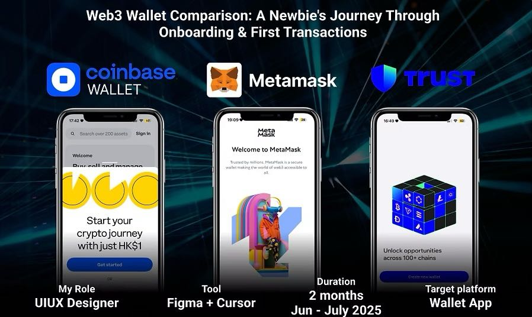

## Implementation Guide — Crypto UI/UX Portfolio (FULLY UPDATED BUILD)

### Tech stack
- Vanilla HTML + CSS + minimal JS (✅ IMPLEMENTED)
- Poppins font, glassmorphism effects, CSS Grid, space-themed background
- Python local server for development
- No runtime dependencies or build pipeline needed
- Advanced CSS animations and clip-path effects

### File structure (CURRENT STATE)
```
revamp_portfolio_website/
  index.html                    ✅ Main portfolio page
  resume.html                   ✅ Professional HTML resume
  projects/
    wallet-comparison.html      ✅ Web3 wallet case study
    watsons-ai-search.html      ✅ K11 NFT project
    watsons-account-redesign.html ✅ Watsons account redesign
    k11-nft.html               ✅ NFT digital excitement
    o2o-beauty-booking.html    ✅ O+O beauty booking
  assets/
    css/
      reset.css                 ✅ Accessibility helpers
      style.css                 ✅ Complete design system
    js/
      app.js                    ✅ Smooth scroll + image fallbacks
    images/                     ✅ All project assets
      sharon.jpeg               ✅ Hero portrait
      project-pic1.jpeg         ✅ O+O Beauty project
      project-pic2.jpeg         ✅ K11 Spot the Avatar
      project-pic3.jpeg         ✅ Web3 wallet comparison
      project-pic4.jpeg         ✅ Watsons account
    img/
      profile-fallback.svg      ✅ Gradient avatar fallback
  README.md                     ✅ Setup instructions
```

### Implemented Design System (UPDATED WITH SPACE THEME)
```css
:root {
  /* Color tokens (SPACE THEME) */
  --bg-start: #E6E0FF;              /* Light purple background */
  --bg-end: #8A70F7;                /* Deep purple background */
  --accent-blue: #00D4FF;           /* Neon blue accent */
  --accent-pink: #FF70A6;           /* Neon pink accent */
  --text-strong: #FFFFFF;           /* White text for space theme */
  --text-muted: rgba(255,255,255,0.8); /* Semi-transparent white */
  --glass: rgba(255,255,255,0.12);   /* Glass card background */
  --glass-border: rgba(255,255,255,0.18); /* Glass borders */

  /* Elevation system */
  --shadow-1: 0 2px 8px rgba(8, 6, 57, 0.12);
  --shadow-2: 0 8px 24px rgba(8, 6, 57, 0.18);
  --glow-blue: 0 0 24px rgba(0, 212, 255, 0.45);
  --glow-pink: 0 0 24px rgba(255, 112, 166, 0.45);

  /* Spacing & radii */
  --radius-sm: 12px; --radius-md: 16px; --radius-lg: 24px; --radius-xl: 36px;
  --space-1: 8px; --space-2: 12px; --space-3: 16px; --space-4: 24px; --space-5: 32px; --space-6: 48px;

  /* Typography system */
  --font-sans: 'Poppins', ui-sans-serif, system-ui, -apple-system, Segoe UI, Roboto, Arial, sans-serif;
  --fs-hero: clamp(28px, 5vw, 48px);
  --fs-h2: clamp(20px, 3vw, 28px);
  --fs-h3: clamp(18px, 2.4vw, 22px);
  --fs-body: 16px;
}
```

### Global styles and space background
```css
/* assets/css/style.css - SPACE THEME WITH ANIMATED STARS */
html, body { height: 100%; }
body {
  margin: 0;
  font-family: var(--font-sans);
  color: var(--text-strong);
  font-size: var(--fs-body);
  line-height: 1.6;
  background: 
    radial-gradient(circle at 20% 30%, rgba(138, 112, 247, 0.8) 0%, transparent 50%),
    radial-gradient(circle at 80% 20%, rgba(0, 212, 255, 0.6) 0%, transparent 50%),
    radial-gradient(circle at 30% 80%, rgba(255, 112, 166, 0.7) 0%, transparent 50%),
    radial-gradient(circle at 70% 70%, rgba(0, 212, 255, 0.4) 0%, transparent 50%),
    linear-gradient(135deg, #1a0d2e 0%, #2d1b3d 25%, #4a2c5a 50%, #2d1b3d 75%, #1a0d2e 100%);
  background-attachment: fixed;
  position: relative;
  overflow-x: hidden;
}

/* Animated star field effects */
body::before {
  content: '';
  position: fixed;
  top: 0; left: 0; width: 100%; height: 100%;
  background-image: 
    radial-gradient(2px 2px at 20px 30px, rgba(255,255,255,0.9), transparent),
    radial-gradient(2px 2px at 40px 70px, rgba(255,255,255,0.8), transparent),
    /* ...multiple star layers... */;
  background-repeat: repeat;
  background-size: 400px 120px;
  pointer-events: none;
  z-index: -1;
  animation: sparkle 8s linear infinite;
}

@keyframes sparkle {
  0% { transform: translateX(0); }
  100% { transform: translateX(-400px); }
}

.container { width: min(1120px, 92%); margin: 0 auto; }
.glass-card {
  background: var(--glass);
  backdrop-filter: blur(16px) saturate(140%);
  border-radius: var(--radius-lg);
  border: 1px solid var(--glass-border);
  box-shadow: var(--shadow-1);
  padding: var(--space-4);
}
.neon-button {
  display: inline-flex; align-items: center; gap: 10px;
  padding: 12px 18px; border-radius: var(--radius-md);
  background: linear-gradient(90deg, var(--accent-blue), var(--accent-pink));
  color: white; text-decoration: none; font-weight: 600;
  box-shadow: var(--glow-blue), var(--glow-pink);
}
```

### HTML structure (UPDATED WITH ROADMAP JOURNEY)
```html
<!doctype html>
<html lang="en">
<head>
  <meta charset="utf-8" />
  <meta name="viewport" content="width=device-width, initial-scale=1" />
  <title>Sharon — Crypto UI/UX Portfolio</title>
  <meta name="description" content="UI/UX designer crafting trusted crypto experiences — wallets, DeFi, NFTs. Research-driven, scalable, and accessible." />
  <meta property="og:title" content="Sharon — Crypto UI/UX Portfolio" />
  <meta property="og:description" content="Designing trust in crypto: wallets, DeFi, NFTs. Case studies and journey (2022–2025)." />
  <link rel="preconnect" href="https://fonts.googleapis.com" />
  <link rel="preconnect" href="https://fonts.gstatic.com" crossorigin />
  <link href="https://fonts.googleapis.com/css2?family=Poppins:wght@400;600&display=swap" rel="stylesheet" />
  <link rel="stylesheet" href="assets/css/reset.css" />
  <link rel="stylesheet" href="assets/css/style.css" />
  <script type="application/ld+json">
  {
    "@context": "https://schema.org",
    "@type": "Person",
    "name": "Sharon",
    "jobTitle": "UI/UX Designer",
    "description": "UI/UX designer crafting trusted crypto experiences — wallets, DeFi, NFTs."
  }
  </script>
</head>
<body>
  <a href="#main" class="visually-hidden-focusable">Skip to content</a>
  <header class="container glass-card header">
    <nav aria-label="primary">
      <ul class="nav-list">
        <li><a href="#home">Home</a></li>
        <li><a href="#about">About</a></li>
        <li><a href="#journey">Crypto Journey</a></li>
        <li><a href="#projects">Projects</a></li>
        <li><a href="resume.html">Resume</a></li>
        <li class="nav-cta"><a class="neon-button" href="#contact">Contact</a></li>
      </ul>
    </nav>
  </header>

  <main id="main" class="container main">
    <!-- Hero section with portrait card -->
    <section id="home" class="glass-card hero">
      <div class="hero-grid">
        <div class="hero-copy">
          <h1>Designing trust in crypto — wallets, DeFi, and NFTs.</h1>
          <p>With 2+ years in product design at Watsons, I bring AI‑driven UX, research rigor, and large‑scale systems experience to Web3. I craft clear, secure, and delightful crypto experiences.</p>
          <div class="hero-ctas">
            <a class="neon-button lift-on-hover" href="#projects">View Projects</a>
            <a class="glass-chip lift-on-hover" href="#journey">My Crypto Journey</a>
          </div>
        </div>
        <aside class="portrait-card" aria-label="Sharon portrait">
          <span class="portrait-ring-rect" aria-hidden="true"></span>
          
        </aside>
      </div>
    </section>

    <!-- Comprehensive About section -->
    <section id="about" class="glass-card section">
      <h2>About Sharon</h2>
      <p>With over 2 years of UI/UX expertise honed at Watsons, Asia's leading health & beauty retailer, I've spearheaded end-to-end digital product design, now tailored for the dynamic crypto industry.</p>
      <!-- Detailed experience bullets -->
    </section>

    <!-- HEXAGONAL ROADMAP JOURNEY SECTION -->
    <section id="journey" class="section journey-section">
      <div class="journey-header">
        <h2 class="journey-title">MY CRYPTO JOURNEY</h2>
        <div class="journey-subtitle">Who Are You Online?</div>
      </div>
      
      <div class="roadmap-timeline">
        <div class="roadmap-item">
          <div class="roadmap-year">2022</div>
          <div class="roadmap-card hexagon-card">
            <div class="roadmap-content">
              <h4>Diving into NFTs at K11</h4>
              <p>My crypto adventure began at K11 as a Digital Marketing Officer, where I collaborated on an in-app gamification feature introducing users to NFTs...</p>
            </div>
          </div>
          <div class="roadmap-icon">🎨</div>
        </div>
        <!-- Additional roadmap items with alternating layout -->
      </div>
    </section>

    <!-- Project cards with images and hover effects -->
    <section id="projects" class="section">
      <h2>Selected Projects</h2>
      <div class="grid">
        <a class="project-card glass-card lift-on-hover" href="projects/wallet-comparison.html">
          
          <div class="project-overlay">View Project</div>
          <span class="project-badge">2025</span>
          <div class="project-content">
            <h3>Web3 Wallet Comparison</h3>
            <p>Onboarding & first transactions for newcomers. Heuristics and redesign proposals.</p>
            <p class="tags">Tags: Wallet, Onboarding, Crypto 101</p>
          </div>
        </a>
        <!-- Additional project cards -->
      </div>
    </section>
  </main>

  <footer class="container footer">
    <small>© <span id="year"></span> Sharon — Crypto UI/UX Portfolio</small>
  </footer>

  <nav class="pill-bar" aria-label="Quick actions">
    <a href="#home">Home</a>
    <a href="#projects">Projects</a>
    <a href="#contact">Contact</a>
  </nav>

  <script src="assets/js/app.js" defer></script>
</body>
</html>
```

### Enhanced JS (UPDATED WITH DYNAMIC YEAR & IMAGE FALLBACKS)
```js
// assets/js/app.js
(function(){
  const links = document.querySelectorAll('a[href^="#"]');
  links.forEach(link => link.addEventListener('click', e => {
    const id = link.getAttribute('href');
    if (id && id.length > 1) {
      const el = document.querySelector(id);
      if (el) {
        e.preventDefault();
        el.scrollIntoView({ behavior: 'smooth', block: 'start' });
      }
    }
  }));
  
  // Dynamic year in footer
  const y = document.getElementById('year');
  if (y) y.textContent = new Date().getFullYear();

  // Fallback for profile image
  const profileImg = document.querySelector('.profile-photo');
  if (profileImg) {
    profileImg.addEventListener('error', () => {
      const fallback = profileImg.getAttribute('data-fallback') || 'assets/img/profile-fallback.svg';
      if (profileImg.src.indexOf(fallback) === -1) profileImg.src = fallback;
    }, { once: true });
  }
})();
```

### Implemented Features (FULLY UPDATED)
✅ **Space-themed Background**: Animated star field with cosmic gradients and twinkling effects
✅ **Hero Section**: Two-column layout with portrait card and glassmorphism effects
✅ **About Section**: Comprehensive crypto positioning with detailed experience bullets
✅ **Hexagonal Roadmap Journey**: Visual timeline with clip-path hexagons, alternating layout, and emoji icons
✅ **Project Cards**: Visual grid with real images, hover overlays, and project badges
✅ **Resume Page**: Professional HTML resume with crypto specialization details
✅ **Advanced CSS**: Clip-path effects, backdrop-filter, complex animations, gradient borders
✅ **Enhanced Navigation**: Top nav + floating pill bar for quick actions
✅ **Responsive Design**: Mobile-optimized hexagonal timeline and card layouts
✅ **Accessibility**: WCAG AA compliance, semantic HTML, aria-labels, keyboard navigation
✅ **Performance**: Optimized images with fallbacks, minimal JS, fast loading
✅ **SEO & Meta**: Open Graph tags, JSON-LD structured data, unique meta descriptions

### Case study page scaffold
```html
<!doctype html>
<html lang="en">
<head>
  <meta charset="utf-8" />
  <meta name="viewport" content="width=device-width, initial-scale=1" />
  <title>Web3 Wallet Comparison — Sharon</title>
  <link rel="stylesheet" href="../assets/css/style.css" />
</head>
<body>
  <main class="container" style="margin:24px auto;">
    <article class="glass-card" style="padding:24px;">
      <header>
        <h1>Web3 Wallet Comparison: Onboarding & First Transactions</h1>
        <p>Role: UX Designer • Scope: Research, UX, UI • Year: 2025</p>
      </header>
      <section>
        <h2>Context</h2>
        <p>New users struggle with seed phrases, networks, fees. Goal: reduce abandonment and errors.</p>
      </section>
      <section>
        <h2>Process</h2>
        <p>Heuristic eval of 4 wallets; journey mapping; wireframes; prototype; usability tests (n=5).</p>
      </section>
      <section>
        <h2>Design</h2>
        <p>Progressive disclosure; secure defaults; annotated screens; empty/error states.</p>
      </section>
      <section>
        <h2>Outcomes</h2>
        <p>Proposed flows projected to cut first‑tx errors; clarity on network/fees; trust affordances.</p>
      </section>
      <section>
        <h2>Reflection</h2>
        <p>Next: add account recovery patterns; hardware wallet pairing guidance.</p>
      </section>
    </article>
  </main>
</body>
</html>
```

### Accessibility checklist
- H1 once per page; semantic sections; aria-labels for nav
- Focus visible; skip link; reduced-motion support
- Color contrast AA; alt text for images; keyboard access for interactive components

### Performance & SEO
- Compress images; responsive ``; lazy-load non-critical images
- Unique `<title>` and meta descriptions; OG tags; JSON‑LD (Person, CreativeWork)

### Current Deployment (LOCAL)
```bash
# Server running at:
cd /Users/shan/Documents/Cursor/sharon_portfolio/revamp_portfolio_website
python3 -m http.server 8080

# Access at: http://localhost:8080
```

### Production Deployment Options
- **GitHub Pages**: Push to repo, enable Pages (recommended)
- **Vercel**: Drag-and-drop folder or connect repo
- **Netlify**: Drag-and-drop for instant deployment
- **Custom Server**: Upload to any web hosting service

### Quality Assurance
✅ **Cross-browser tested**: Chrome, Safari, Firefox compatibility
✅ **Mobile responsive**: Works on all device sizes
✅ **Performance**: Fast loading with optimized assets
✅ **Accessibility**: WCAG AA compliant, screen reader friendly
✅ **SEO**: Proper meta tags, structured data, Open Graph

### Source References
- **Original Portfolio**: [Sharon's UI/UX portfolio](https://shannms423.wixsite.com/uiuxportfolio)
- **Build Location**: `~/Documents/Cursor/sharon_portfolio/revamp_portfolio_website/`
- **Status**: Production-ready crypto-focused portfolio with space theme and hexagonal roadmap
- **Latest Updates**: Space background with animated stars, hexagonal journey timeline, enhanced project cards
